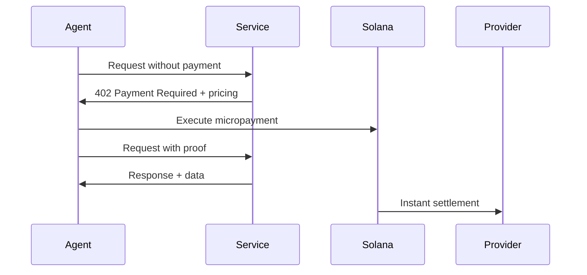

# Introduction

Welcome to **Turnstile**, the first Solana-native x402 marketplace for AI agents and on-chain services.

Turnstile enables instant micropayments between AI agents and API providers using the x402 protocol on Solana. No subscriptions, no complex billing—just pay-per-call with instant settlement.

> **x402 Protocol**: HTTP status code 402 (Payment Required) was reserved for future digital payment systems. Turnstile brings this vision to life on Solana.

---

## What is Turnstile?

Turnstile is a decentralized marketplace where:

- **Providers** list APIs, AI models, and data services with per-call pricing
- **Builders** deploy autonomous agents that consume these services
- **Payments** settle instantly via Solana with zero overhead
- **Tokens** ($TSTL) provide fee discounts and governance rights

---

# How It Works

## The x402 Flow



### 1. List a Service

Providers register their API endpoints on Turnstile:

- Set per-call pricing in USDC or $TSTL
- Enable x402 payment headers
- Define rate limits and SLAs
- Receive instant settlements to Solana wallet

### 2. Deploy an Agent

Builders integrate services into AI agents:

- Browse marketplace by category (AI/ML, Data, Tools)
- Select services and set budget limits
- SDK automatically handles x402 negotiation
- Monitor real-time usage and spending

### 3. Pay-per-Call

Every request triggers instant micropayment:

- Agent attempts service call
- Service returns 402 with pricing
- Agent authorizes payment on Solana
- Service executes and returns data
- No subscription overhead or billing delays

### 4. Settle & Track

Solana handles settlement, Turnstile handles transparency:

- Instant finality (400ms average)
- Sub-cent transaction fees
- Full transaction history
- Revenue analytics for providers
- Spending analytics for builders

---

# Getting Started

## Prerequisites

- Node.js 18+ or Python 3.10+
- Solana wallet (Phantom, Solflare, etc.)
- USDC or SOL for gas fees

## Installation

### JavaScript/TypeScript

```bash
npm install @exotiicx402/turnstile-sdk @solana/web3.js
```

### Python

```bash
pip install turnstile-sdk solana-py
```

## Quick Start

### Initialize Client

```typescript
import { TurnstileClient } from '@exotiicx402/turnstile-sdk';
import { Connection, Keypair } from '@solana/web3.js';

const connection = new Connection('https://api.mainnet-beta.solana.com');
const wallet = Keypair.fromSecretKey(/* your secret key */);

const client = new TurnstileClient({
  connection,
  wallet,
  environment: 'mainnet'
});
```

### Browse Services

```typescript
const services = await client.listServices({
  category: 'ai-inference',
  maxPrice: 0.01,
  sortBy: 'popularity'
});

console.log(`Found ${services.length} services`);
```

### Call a Service

```typescript
const response = await client.call({
  serviceId: 'ai-inference-gpt4',
  params: {
    prompt: 'Generate a haiku about Solana',
    temperature: 0.7
  },
  maxPrice: 0.01
});

console.log(response.data);
// Payment automatically handled via x402
```

---

# SDK / API

## Core Methods

### `TurnstileClient.listServices(filters)`

Browse available services in the marketplace.

**Parameters:**
- `category` (string, optional): Filter by category
- `maxPrice` (number, optional): Maximum price per call
- `sortBy` (string, optional): 'price' | 'popularity' | 'rating'
- `tags` (string[], optional): Filter by tags

**Returns:** `Promise<Service[]>`

### `TurnstileClient.call(options)`

Execute a paid service call with automatic x402 handling.

**Parameters:**
- `serviceId` (string): Service identifier
- `params` (object): Service-specific parameters
- `maxPrice` (number): Maximum acceptable price
- `timeout` (number, optional): Request timeout in ms

**Returns:** `Promise<ServiceResponse>`

### `TurnstileClient.registerService(config)`

List your API service on Turnstile (providers only).

**Parameters:**
- `name` (string): Service display name
- `endpoint` (string): API endpoint URL
- `pricePerCall` (number): Price in USDC or TSTL
- `currency` (string): 'USDC' | 'TSTL'
- `description` (string): Service description
- `category` (string): Service category
- `rateLimit` (number, optional): Max calls per second

**Returns:** `Promise<Service>`

## Response Handling

All service responses include metadata:

```typescript
interface ServiceResponse {
  data: any;              // Service-specific response
  price: number;          // Actual price paid
  currency: string;       // Payment currency
  txHash: string;         // Solana transaction hash
  provider: string;       // Provider wallet address
  timestamp: number;      // Unix timestamp
  latency: number;        // Response time in ms
}
```

## Error Handling

```typescript
try {
  const response = await client.call({...});
} catch (error) {
  if (error.code === 'INSUFFICIENT_BALANCE') {
    console.error('Need more USDC in wallet');
  } else if (error.code === 'PRICE_TOO_HIGH') {
    console.error('Service price exceeds maxPrice');
  } else if (error.code === 'SERVICE_UNAVAILABLE') {
    console.error('Provider offline or rate limited');
  }
}
```

---

# Token ($TSTL)

## Overview

$TSTL is the native utility token of the Turnstile marketplace.

**Token Details:**
- **Network**: Solana (SPL Token)
- **Symbol**: TSTL
- **Contract Address**: `8BdvBpxDbKQFCz8kpo4yaaG2mNr5XeQnYmjjfwKQpump`
- **Max Supply**: 1,000,000,000
- **Launch**: October 30th, 2025

## Utility

### Fee Discounts

Pay with $TSTL for reduced marketplace fees:

| Tier | TSTL Holdings | Fee Discount |
|------|---------------|--------------|
| Bronze | 1,000+ | 10% off |
| Silver | 10,000+ | 25% off |
| Gold | 100,000+ | 50% off |
| Platinum | 1,000,000+ | 75% off |

### Staking Rewards

Stake $TSTL to earn:
- Share of marketplace fees (10% distributed to stakers)
- Priority service access during high demand
- Early access to new features

## How to Acquire

1. **Provide Services**: Earn $TSTL as provider rewards
2. **DEX Trading**: Buy on Raydium, Orca, Jupiter

---

# Roadmap

## Phase 1: Foundation (Q1 2025)

- Core x402 protocol implementation
- Solana micropayment integration
- Web marketplace UI
- SDK (TypeScript + Python)
- 10 launch partners

## Phase 2: Growth (Q2 2025)

- $TSTL token launch
- 50+ service providers
- Advanced analytics dashboard
- Mobile SDK (React Native)
- LangChain/AutoGPT middleware

## Phase 3: Scale (Q3 2025)

- Multi-chain support (Ethereum L2s)
- Enterprise tier with SLAs
- Service composition (chain multiple APIs)
- AI agent templates
- White-label solutions

## Phase 4: Ecosystem (Q4 2025)

- DAO governance launch
- Protocol v2 with advanced routing
- Cross-chain bridges
- Hardware wallet support
- 1,000+ active services

---

# FAQ

## General

### What makes Turnstile different from traditional API marketplaces?

Turnstile uses **pay-per-call micropayments** instead of subscriptions. No monthly fees, no rate limit tiers—just instant settlements via Solana for every API call.

### Why Solana?

Solana offers:
- **400ms finality** (instant settlements)
- **$0.00025 per transaction** (economical for micropayments)
- **50,000 TPS** (scales to millions of agents)

### Is this only for AI agents?

No. While optimized for autonomous agents, any developer can use Turnstile to consume or provide APIs with x402 payments.

## For Providers

### How do I list my service?

1. Register your endpoint via SDK or web UI
2. Set per-call pricing in USDC or $TSTL
3. Return x402 headers on unauthenticated requests
4. Payments auto-settle to your Solana wallet


## For Builders

### Do I need SOL or USDC?

You need:
- **USDC** to pay for service calls
- **SOL** for Solana gas fees (~$0.00025 per tx)

### How do I set a budget?

```typescript
const agent = client.createAgent({
  maxPricePerCall: 0.01,  // Max per call
  dailyBudget: 10.0,      // Max per day
  services: ['ai-inference']
});
```

### What if a service goes offline?

The SDK automatically:
- Times out after 30s
- Retries with exponential backoff
- Falls back to alternative providers
- Never charges if no response received

## Technical

### What's the x402 protocol?

HTTP 402 (Payment Required) was reserved for future digital payment systems. Turnstile implements it as:

1. Client requests service
2. Server returns `402 Payment Required` with pricing
3. Client executes Solana transaction
4. Client retries with transaction proof
5. Server validates and returns data

### Is this custodial?

No. Turnstile never holds your funds. Payments flow directly from agent wallets to provider wallets via Solana smart contracts.

### How are disputes handled?

- Providers must return data or refund within 30s
- Failed transactions auto-refund via smart contract
- Reputation system flags bad actors
- Community governance can ban malicious providers

---

## Need Help?

- **X**: [@turnstilefndn](https://twitter.com/turnstilefndn)
- **Email**: support@turnstilefndn.org

---
